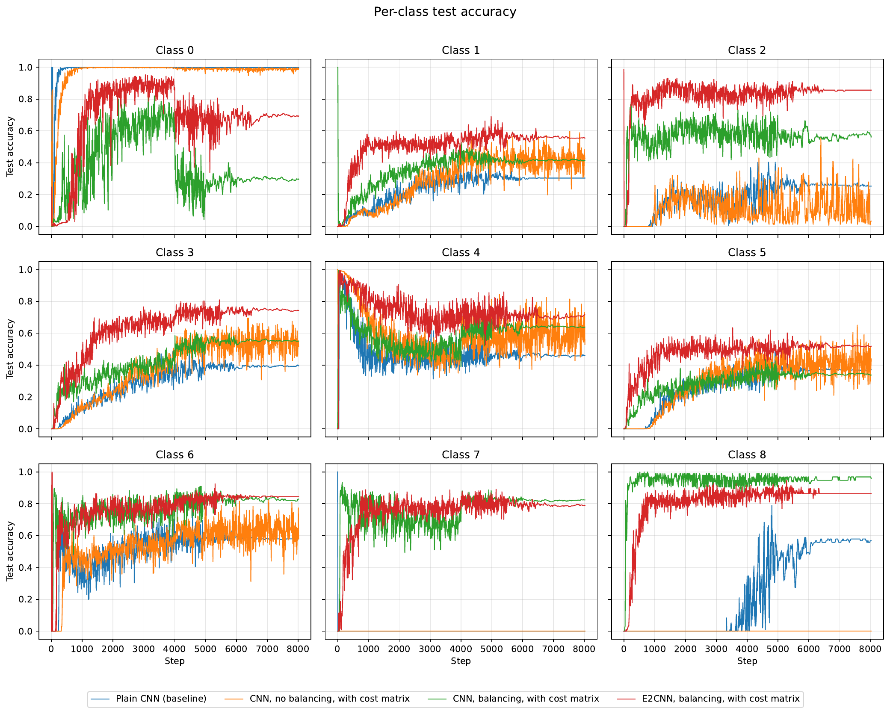
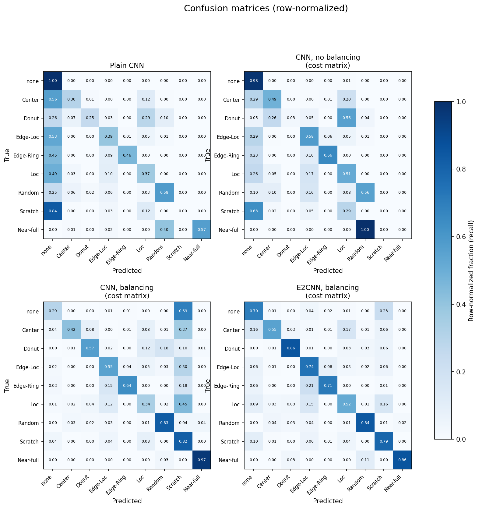

# Wafer Map Defect Recognition

Defect recognition on semiconductor wafers is important because different defect patterns point to different root causes and require different handling. Recognizing a defect promptly can save considerable cost and makes life easier for process engineers, since they can react to the right failure mode instead of investigating from scratch.

This project trains a neural network on the [LSWMD](http://mirlab.org/dataSet/public/) (WM-811K) wafer map dataset to recognize defect types. Two challenges make this harder than a standard classification problem.

## Challenges

1. **Asymmetric error cost.** The price of a recognition error is not the same for every error. A false alarm mostly wastes an engineer's time, while missing a real defect is much more costly, and some defect types are similar to each other and share similar root causes, so confusing them is less severe than confusing entirely unrelated types. Standard cross entropy does not capture any of this, since it treats every misclassification identically.
2. **Class imbalance.** LSWMD is heavily imbalanced. The "none" (no defect) class dominates the dataset, while some defect types have very few samples, which makes it difficult to train a network that recognizes them reliably.

## Approach

Three complementary methods are used to address the two challenges above.

1. **Cost-sensitive loss.** A 9x9 cost matrix encodes the price of every possible mistake, and a customized loss function computes the expected cost of the predicted class distribution against this matrix rather than plain cross entropy. Training with the cost matrix from scratch converges poorly, so the network is first trained with standard cross entropy and then fine-tuned with the cost-sensitive loss.
2. **Data balancing.** A weighted sampler draws minority-class samples more frequently during training, so the rare defect types are seen often enough to be learned.
3. **Rotation-equivariant architecture (E2CNN).** A wafer is round, and a defect's identity does not depend on how the wafer happens to be rotated. [E2CNN](https://github.com/quva-lab/e2cnn) builds this rotation equivariance into the network architecture (see the animation in the repo's "demo" section), which restricts the network's degrees of freedom and lets it generalize better from fewer samples.

Four configurations are compared: a plain CNN trained with ordinary cross entropy, a CNN trained with the cost matrix but without data balancing, a CNN trained with both the cost matrix and data balancing, and an E2CNN trained with both the cost matrix and data balancing.

## Results

### Per-class test accuracy during training

### Confusion matrices

Row-normalized confusion matrices (each row sums to 1, so a cell is the fraction of true samples of that class predicted as the column class) for the final model of each configuration (diagonal elements are correct predictions and off-diagonal elements are false predictions):

### Quantitative comparison

Because "none" makes up about 96% of the test set, plain overall accuracy is misleading here: a model can score high just by predicting "none" most of the time while missing most real defects (this is exactly what happens for the plain-CNN baseline, whose overall accuracy is 95.5% despite a 0% recall on the Scratch class). The two metrics below instead weight every class equally, which is the fair comparison for an imbalanced problem like this one.

* **Macro recall** — the per-class test recall (the values plotted above) averaged equally across all nine classes.
* **Macro cost** — the average cost from the same cost matrix used in training, computed per class and then averaged equally across all nine classes, so it isn't dominated by the "none" class's sample count either.

| Configuration | Macro recall | Macro cost (lower is better) |
| --- | --- | --- |
| Plain CNN (baseline) | 43.6% | 0.989 |
| CNN, no balancing, with cost matrix | 42.3% | 0.810 |
| CNN, balancing, with cost matrix | 60.3% | 0.415 |
| E2CNN, balancing, with cost matrix | **73.1%** | **0.328** |

E2CNN with balancing and the cost matrix gives the best result on both metrics. Its macro recall of 73.1% is a 67% relative improvement over the plain-CNN baseline's 43.6% (a 29.4-percentage-point gain), and a 21% relative improvement over the next-best configuration, CNN with balancing and the cost matrix. Its macro cost of 0.328 is 67% lower than the baseline's 0.989 and 21% lower than CNN with balancing and the cost matrix, confirming that adding rotation equivariance on top of balancing and the cost-sensitive loss meaningfully reduces the price of the network's remaining mistakes, not just their count.

It is expected that with more data samples of under-represented classes, the prediction accuracy can be improved further to reduce manufacturing costs.
